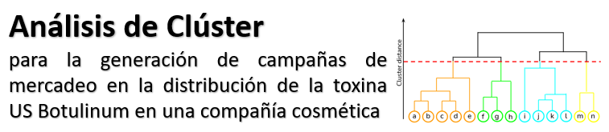

  

 

  

 
En este proyecto nos concentraremos en realizar un análisis de datos, los cuales fueron recopilados por medio de la plataforma de <strong>Google Analytics</strong> por una empresa cosmética. La base de datos contiene información de las sesiones (las visitas de los usuarios a la página web), e información relacionada con los intereses, edad, sexo y demás atributos de los usuarios que visitan la página. Haciendo uso del conocimiento adquirido en <strong>clusterización</strong> realizaremos la segmentación de audiencias con el fin de entender la naturaleza de los datos y generar conocimiento con valor agregado para la creación de las campañas de mercadeo.

<h2 >Estructura del repositorio:</h2> 
<ol>
    <li><a href="Code/">Code</a>: Actualmente contiene un archivo con el análisis estadístico de nuestros datos de entrada, en el futuro también encontraremos el archivo con nuestro modelo de clusterización aplicado.</li>
    <li><a href="Docs/">Docs</a>: Encontramos el archivo con la propuesta y descripción del proyecto incluyendo el análisis inicial de los datos.</li>
    <li><a href="Img/">Img</a>: Imagenes utilizadas en el archivo README.md</li>
    <li><a href="Inputs/">Inputs</a>: Esta ubicado el archivo CSV el cual utilizamos como input para nuestro modelo</li>
</ol>

<h2 >Objetivos:</h2> 
<ul>
    <li>Aplicar la clusterización jerárquica como técnica de aprendizaje no supervisado para agrupar datos en clústeres.</li>
    <li>Identificar patrones y estructuras ocultas en el conjunto de datos sin requerir etiquetas previas. </li>
    <li>Generar conocimientos valiosos a partir de la interpretación de los resultados de la clusterización.</li> 
</ul>

<h2 >Metodología Propuesta: </h2> 
<ol>
    <li>Recopilación y Preprocesamiento de Datos.</li>
    <li>Selección de Variables.</li>
    <li>Configuración de Parámetros.</li>
        - métodos de enlace. 
        - métricas de distancia. 
    <li>Aplicación de Clusterización Jerárquica.</li>
        - Uso de dendrograma para visualizar la estructura jerárquica de los clústeres.
    <li>Evaluación del Número Óptimo de Clústeres.</li>
        - elbow method. 
        - índice de silueta. 
        - otros métodos de selección de clústeres en caso de ser necesario.
    <li>Interpretación de Resultados.</li>
    <li>Validación de Resultados.</li>
    <li>Documentación y Comunicación de Resultados.</li>
</ol>

Si deseas más información acerca del proyecto, te puedes dirigir al archivo [Propuesta inicial](<Docs/Análisis de Clúster - proyecto final.pdf>).

<h2 >Integrantes:</h2> 
<ul>
    <li>Sergio Rojas</li>
    <li>Gloria Ramos </li>
    <li>Andres Beltrán</li>
    <li>Cristhian Amaya</li>
</ul>

  

