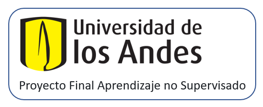

  

<h1 align="center"> Análisis de Clúster para la generación de campañas de mercadeo en la distribución de la toxina US Botulinum en una compañía cosmética </h1>

 
En este proyecto nos concentraremos en realizar un análisis de datos, los cuales fueron recopilados por medio de la plataforma de <strong>Google Analytics</strong> por una empresa cosmética. La base de datos contiene información de las sesiones (las visitas de los usuarios a la página web), e información relacionada con los intereses, edad, sexo y demás atributos de los usuarios que visitan la página. Haciendo uso del conocimiento adquirido en <strong>clusterización</strong> realizaremos la segmentación de audiencias con el fin de entender la naturaleza de los datos y generar conocimiento con valor agregado para la creación de las campañas de mercadeo.

Si deseas más información acerca del proyecto, te puedes dirigir al archivo [Propuesta inicial](Docs/Propuesta_Inicial_grupo_15.docx).

<h2 >Estructura del repositorio:</h2> 
<ol>
    <li><a href="Code/">Code</a></li> texto
    <li><a href="Docs/">Docs</a></li> texto
    <li><a href="Img/">Img</a></li>
    <li><a href="Inputs/">Inputs</a></li>
</ol>

<h2 >Objetivos:</h2> 
<ul>
    <li>Aplicar la clusterización jerárquica como técnica de aprendizaje no supervisado para agrupar datos en clústeres.</li>
    <li>Identificar patrones y estructuras ocultas en el conjunto de datos sin requerir etiquetas previas. </li>
    <li>Generar conocimientos valiosos a partir de la interpretación de los resultados de la clusterización.</li> 
</ul>

